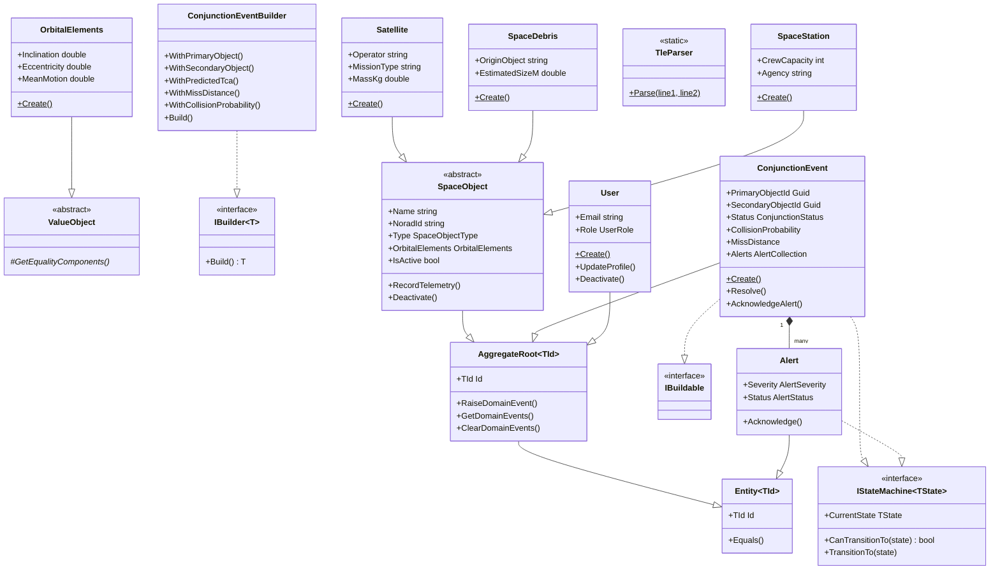
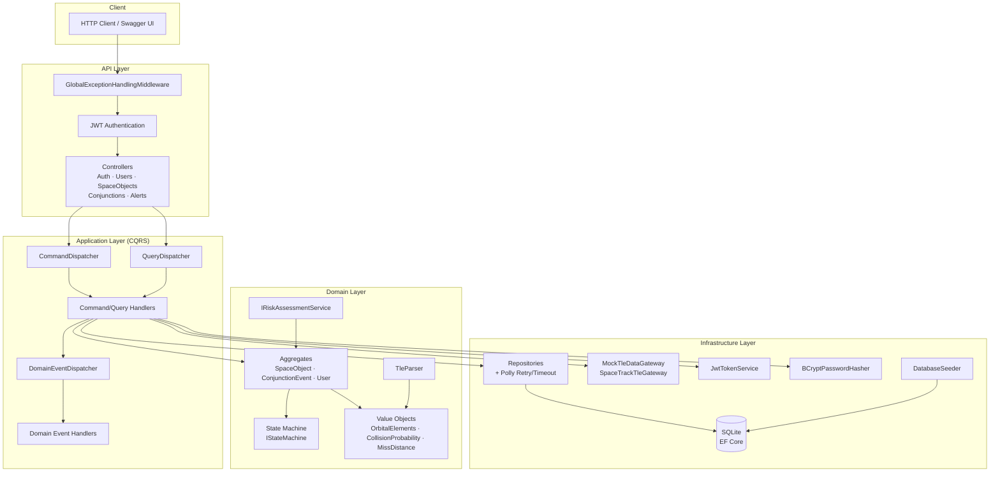

# Orbital Guardian API

## Descrição

**Orbital Guardian** é uma API REST para monitoramento de conjunções orbitais — situações em que dois objetos espaciais (satélites, detritos ou estações) se aproximam a uma distância perigosa. O sistema avalia a probabilidade de colisão, emite alertas automáticos e gerencia o ciclo de vida das conjunções detectadas com autenticação JWT e controle de acesso baseado em papéis.

O projeto implementa os princípios de **Domain-Driven Design (DDD)** com arquitetura em camadas (Domain → Application → Infrastructure → API), CQRS manual com dispatchers via reflexão, State Machine para transições de estado, padrão Builder para criação de aggregates complexos, e resiliência via Polly (retry + timeout). Os dados orbitais são importados no formato TLE (Two-Line Element, padrão NORAD) e a persistência é feita com SQLite via Entity Framework Core.

## Conexão com os ODS

| ODS | Conexão |
|-----|---------|
| **ODS 8** — Trabalho Decente e Crescimento Econômico | Automação do monitoramento orbital reduz o custo operacional de missões espaciais |
| **ODS 9** — Indústria, Inovação e Infraestrutura | Infraestrutura crítica para proteção de satélites de comunicação e observação |
| **ODS 11** — Cidades e Comunidades Sustentáveis | Satélites de observação dependem de órbitas seguras para monitorar desastres naturais |
| **ODS 13** — Ação Contra a Mudança Global do Clima | Satélites climáticos e meteorológicos requerem proteção contra colisões orbitais |

## Integrantes

| Nome | RM |
|------|----|
| João Monteiro de Furtado Romero | RM559154 |

## Tecnologias

- **.NET 8** / **ASP.NET Core 8** — framework web
- **Entity Framework Core 8** + **SQLite** — ORM e banco de dados
- **Polly** — resiliência: retry exponencial + timeout por repositório
- **JWT Bearer** — autenticação stateless com HMAC-SHA256
- **BCrypt.Net** — hash de senhas com work factor 12
- **Docker** + **Docker Compose** — containerização e orquestração
- **xUnit** + **Moq** + **FluentAssertions** — testes unitários e de integração
- **Swashbuckle** — Swagger UI com suporte a JWT

## Execução

### Via Docker (recomendado)

```bash
# Clonar o repositório
git clone https://github.com/<usuario>/orbital-guardian-api.git
cd orbital-guardian-api

# Build e start
make build
make up

# API disponível em:
# http://localhost:8080/swagger
```

### Local (sem Docker)

> Requer `aspnet-runtime-8.0` instalado.

```bash
dotnet run --project src/OrbitalGuardian.API
```

### Credenciais do admin padrão

| Campo | Valor |
|-------|-------|
| Email | `admin@orbitalguardian.com` |
| Senha | `Admin@123` |

### Seed de dados

Após o `make up`, o sistema já cria o admin automaticamente. Para importar dados TLE:

```bash
make seed
```

## Makefile — targets disponíveis

| Target | Descrição |
|--------|-----------|
| `make build` | Build da imagem Docker |
| `make up` | Sobe a API em background |
| `make down` | Para e remove os containers |
| `make logs` | Streama logs da API |
| `make seed` | Login + importação de TLEs |
| `make test` | Executa a suite de testes |
| `make run-local` | Executa a API localmente |

## Diagrama de Classes



## Diagrama de Arquitetura


