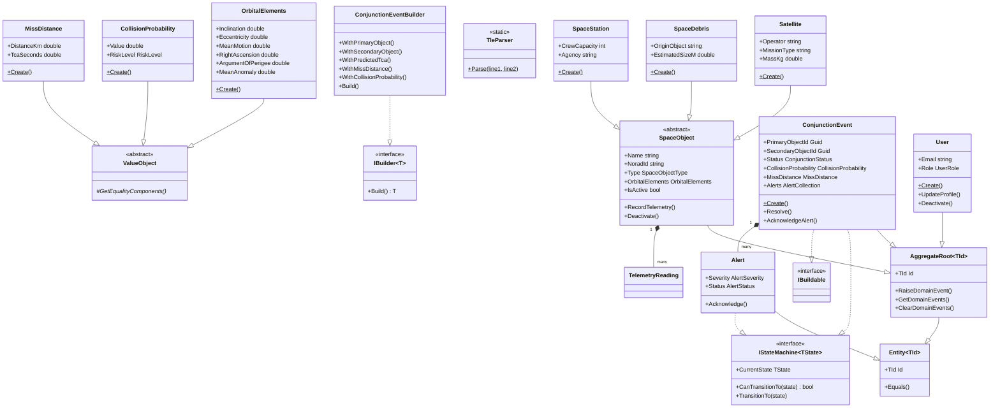
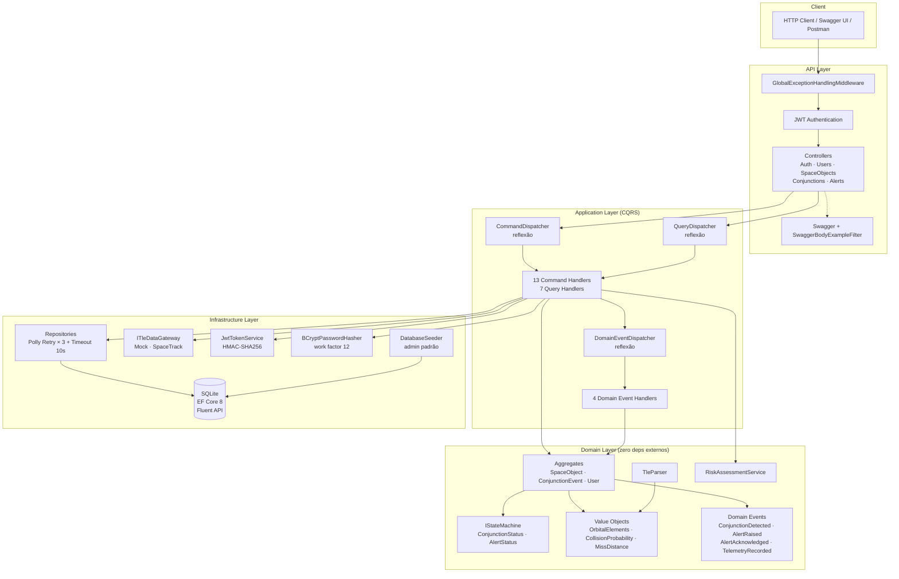
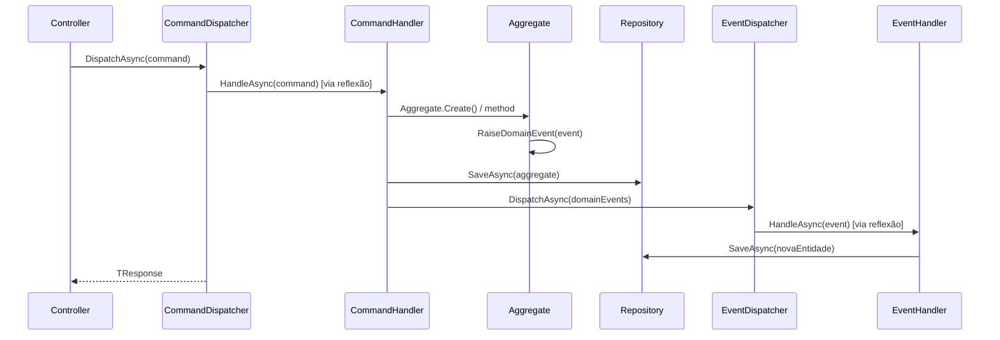

# Orbital Guardian API

> API REST para monitoramento de conjunções orbitais e gestão de objetos espaciais, com autenticação JWT, controle de acesso por papéis, importação de dados TLE e emissão automática de alertas de colisão.

---

## Sumário

1. [Contexto da Global Solution](#1-contexto-da-global-solution)
2. [O Problema: Lixo Espacial e Conjunções Orbitais](#2-o-problema-lixo-espacial-e-conjunções-orbitais)
3. [A Solução: Orbital Guardian](#3-a-solução-orbital-guardian)
4. [Modelagem de Negócio](#4-modelagem-de-negócio)
5. [Arquitetura e Padrões de Projeto](#5-arquitetura-e-padrões-de-projeto)
6. [Estrutura de Pastas](#6-estrutura-de-pastas)
7. [Diagramas](#7-diagramas)
8. [Stack Tecnológica e Dependências](#8-stack-tecnológica-e-dependências)
9. [Como Executar](#9-como-executar)
10. [Endpoints da API](#10-endpoints-da-api)
11. [Testes](#11-testes)
12. [Integrantes](#12-integrantes)

---

## 1. Contexto da Global Solution

A **Global Solution (GS)** é o projeto semestral integrador da FIAP, onde os alunos desenvolvem uma solução tecnológica para um problema real, conectando-a com os **Objetivos de Desenvolvimento Sustentável (ODS)** da ONU.

Neste semestre, o tema central é o **espaço e a sustentabilidade orbital**. O desafio proposto é criar uma aplicação que contribua para a proteção da infraestrutura espacial — satélites de comunicação, meteorológicos e de observação da Terra — frente ao crescente problema do lixo orbital.

### Conexão com os ODS

| ODS | Relevância |
|-----|-----------|
| **ODS 9** — Indústria, Inovação e Infraestrutura | Proteção de satélites que sustentam infraestrutura de comunicação, GPS e internet global |
| **ODS 11** — Cidades e Comunidades Sustentáveis | Satélites de observação monitoram desastres naturais e apoiam o planejamento urbano |
| **ODS 13** — Ação Contra a Mudança Global do Clima | Satélites climáticos e meteorológicos dependem de órbitas seguras para operar |
| **ODS 8** — Trabalho Decente e Crescimento Econômico | Automação do monitoramento orbital reduz custo operacional de missões espaciais |

---

## 2. O Problema: Lixo Espacial e Conjunções Orbitais

### 2.1 O Cenário Atual

Desde o lançamento do Sputnik em 1957, a humanidade enviou mais de **12.000 satélites** ao espaço. Atualmente, aproximadamente **4.500** estão operacionais — o restante são satélites mortos, estágios de foguetes e fragmentos de colisões anteriores.

A ESA (Agência Espacial Europeia) estima que existem:
- ~36.500 objetos maiores que 10 cm em órbita
- ~1.000.000 objetos entre 1 e 10 cm
- ~130.000.000 objetos menores que 1 cm

Mesmo um fragmento de 1 cm viajando a ~28.000 km/h carrega energia cinética suficiente para inutilizar um satélite. O fenômeno chamado **Síndrome de Kessler** prevê que, a partir de certo ponto, colisões em cascata podem tornar determinadas órbitas completamente inutilizáveis por décadas.

### 2.2 O que é uma Conjunção Orbital?

Uma **conjunção orbital** é um evento em que dois objetos espaciais se aproximam a uma distância considerada perigosa em suas trajetórias orbitais. Não significa necessariamente colisão, mas indica risco elevado que precisa ser monitorado e avaliado.

Agências espaciais como NASA, ESA e SpaceX recebem **centenas de alertas de conjunção por semana**. A maioria é descartada após análise mais detalhada, mas algumas exigem manobras de desvio — que consomem combustível precioso e reduzem a vida útil do satélite.

### 2.3 O que é TLE (Two-Line Element)?

O **TLE (Two-Line Element Set)** é o formato padrão da NORAD/NASA para descrever os parâmetros orbitais de um objeto espacial. Consiste em duas linhas de dados que codificam:

```
STARLINK-1234
1 48274U 21082B   23171.58234901  .00004832  00000-0  34821-3 0  9993
2 48274  53.0526  74.5412 0001347  89.3256 270.6134 15.06457742234782
```

- **Linha 1**: identificação, época, termos de arrasto, número de revolucões
- **Linha 2**: inclinação, ascensão reta, excentricidade, argumento do perigeu, anomalia média, movimento médio

O sistema consome esses dados via gateway externo (Space-Track.org) ou mock para popular automaticamente o banco de objetos espaciais.

### 2.4 O que é Probabilidade de Colisão?

A **probabilidade de colisão** (Pc) é calculada a partir da distância de miss, tamanho dos objetos e incertezas nas trajetórias. É expressa como um número entre 0 e 1:

| Faixa | Classificação | Ação típica |
|-------|--------------|-------------|
| < 1×10⁻⁵ | Baixo risco | Monitoramento passivo |
| 1×10⁻⁵ a 1×10⁻⁴ | Risco médio | Acompanhamento ativo |
| 1×10⁻⁴ a 1×10⁻³ | Alto risco | Avaliação de manobra |
| ≥ 1×10⁻³ | Risco crítico | Manobra de desvio recomendada |

O limiar operacional da NASA para análise detalhada é **1×10⁻⁴ (0,01%)**.

### 2.5 O que é Miss Distance e TCA?

- **Miss Distance (distância de aproximação mínima)**: a menor distância entre dois objetos em toda a trajetória prevista, medida em quilômetros.
- **TCA (Time of Closest Approach)**: o instante UTC em que os dois objetos estarão na menor distância entre si.
- **TCA Seconds**: tempo em segundos até o TCA, componente essencial do cálculo de risco.

### 2.6 Por que Automatizar?

Hoje, operadores de satélites recebem relatórios de conjunção em formato de planilha e precisam analisar manualmente centenas de eventos por semana. Um sistema como o Orbital Guardian automatiza:

1. A **ingestão de dados TLE** via API pública
2. O **registro de eventos de conjunção** quando dois objetos se aproximam
3. A **avaliação de risco** com base na probabilidade de colisão
4. A **emissão automática de alertas** com severidade proporcional ao risco
5. O **ciclo de vida** de cada evento (ativo → resolvido/expirado)
6. O **controle de acesso** por papel para diferentes níveis de operador

---

## 3. A Solução: Orbital Guardian

### 3.1 Visão Geral

O **Orbital Guardian** é uma API REST que centraliza o monitoramento orbital em uma interface única. Operadores e analistas podem cadastrar objetos espaciais, registrar eventos de conjunção, acompanhar alertas e gerenciar o ciclo de vida completo de cada situação de risco.

### 3.2 Funcionalidades

| Funcionalidade | Descrição |
|---------------|-----------|
| **Gestão de Objetos Espaciais** | Cadastro de satélites, detritos e estações espaciais com parâmetros orbitais TLE completos |
| **Importação TLE** | Importação automática de dados orbitais via Space-Track.org (ou mock configurável) |
| **Registro de Telemetria** | Leituras de posição e velocidade em coordenadas ECI (km e km/s) com timestamp |
| **Detecção de Conjunções** | Registro de eventos de conjunção entre dois objetos com TCA previsto |
| **Avaliação de Risco Automática** | Cálculo de nível de risco baseado na probabilidade de colisão via `RiskAssessmentService` |
| **Alertas Automáticos** | Emissão automática de alertas com severidade proporcional ao risco detectado |
| **Ciclo de Vida de Conjunções** | Máquina de estados: Ativo → Resolvido / Expirado |
| **Reconhecimento de Alertas** | Operadores confirmam ciência do alerta, registrando timestamp de reconhecimento |
| **Autenticação JWT** | Tokens stateless com HMAC-SHA256, validade de 60 minutos |
| **Controle de Acesso por Papel** | Admin, Operator e Analyst com permissões distintas por rota |
| **Soft Delete** | Objetos e usuários são desativados, não removidos fisicamente |
| **Resiliência** | Retry exponencial (3×) e timeout (10s) em todas as operações de repositório |

---

## 4. Modelagem de Negócio

### 4.1 Papéis e Permissões (Roles)

O sistema tem três papéis com acesso progressivamente restrito:

| Papel | Descrição | Acesso |
|-------|-----------|--------|
| **Admin** | Administrador do sistema | Acesso total: gerencia usuários, importa TLEs, deleta conjunções |
| **Operator** | Operador de monitoramento | Cria e monitora objetos espaciais e conjunções, reconhece alertas |
| **Analyst** | Analista de dados | Somente leitura: consulta objetos, conjunções e alertas |

Matriz de permissões detalhada:

| Recurso | Admin | Operator | Analyst |
|---------|-------|----------|---------|
| Registrar/listar usuários | ✅ | ❌ | ❌ |
| Criar satélite/detrito/estação | ✅ | ✅ | ❌ |
| Importar TLE | ✅ | ❌ | ❌ |
| Consultar objetos espaciais | ✅ | ✅ | ✅ |
| Adicionar telemetria | ✅ | ✅ | ❌ |
| Registrar conjunção | ✅ | ✅ | ❌ |
| Consultar conjunções/alertas | ✅ | ✅ | ✅ |
| Reconhecer alertas | ✅ | ✅ | ❌ |
| Deletar conjunção | ✅ | ❌ | ❌ |
| Deletar objeto espacial | ✅ | ✅ | ❌ |

### 4.2 Objetos Espaciais

O sistema suporta três tipos de objetos espaciais, todos compartilhando a mesma base de parâmetros orbitais TLE:

**Satélite (`Satellite`)**
- Campos exclusivos: operador (empresa/agência), tipo de missão, massa em kg
- Exemplo: STARLINK-1234, operado pela SpaceX, missão de comunicações, 260 kg

**Detrito Espacial (`SpaceDebris`)**
- Campos exclusivos: objeto de origem (de qual satélite ou colisão foi gerado), tamanho estimado em metros
- Exemplo: COSMOS 954 DEB, fragmento do satélite soviético Cosmos 954, ~15 cm

**Estação Espacial (`SpaceStation`)**
- Campos exclusivos: agência responsável, capacidade de tripulação
- Exemplo: ISS (ZARYA), operada pelo ISS Program, capacidade para 7 tripulantes

**Parâmetros orbitais comuns (Value Object `OrbitalElements`):**

| Parâmetro | Unidade | Descrição |
|-----------|---------|-----------|
| Inclination | graus (0–180°) | Ângulo da órbita em relação ao equador terrestre |
| Eccentricity | adimensional (0–1) | Forma da órbita (0 = circular, >0 = elíptica) |
| MeanMotion | rev/dia | Número de voltas completas ao redor da Terra por dia |
| RightAscension | graus | Ascensão reta do nodo ascendente (posição longitudinal do plano orbital) |
| ArgumentOfPerigee | graus | Ângulo do ponto mais próximo da Terra na órbita |
| MeanAnomaly | graus | Posição angular do objeto na órbita no momento da época |

### 4.3 Conjunções e Alertas

Quando dois objetos orbitais se aproximam perigosamente, um evento de conjunção é registrado. O sistema então:

1. Calcula o **nível de risco** com base na probabilidade de colisão informada
2. Emite automaticamente um ou mais **alertas** via domain event
3. Classifica a **severidade** do alerta de acordo com a tabela:

| Nível de Risco | Prob. de Colisão | Severidade do Alerta |
|---------------|-----------------|---------------------|
| Low | < 1×10⁻⁵ | Informational |
| Medium | 1×10⁻⁵ a 1×10⁻⁴ | Warning |
| High | 1×10⁻⁴ a 1×10⁻³ | Critical |
| Critical | ≥ 1×10⁻³ | Emergency |

### 4.4 Ciclo de Vida de uma Conjunção (State Machine)

```
           ┌──────────────────────────────────┐
           │                                  │
     POST  ▼                                  │
  /conjunctions                               │
     ┌─────────┐   Resolve()    ┌──────────┐  │
     │  Active │ ─────────────▶ │ Resolved │  │
     └─────────┘                └──────────┘  │
          │                                   │
          │  TransitionTo(Expired)             │
          ▼                                   │
     ┌─────────┐                              │
     │ Expired │ ─────────────────────────────┘
     └─────────┘
        (DELETE)
```

- **Active**: conjunção recém-detectada, alertas emitidos, exige monitoramento
- **Resolved**: evento encerrado (manobra executada, risco descartado após análise)
- **Expired**: evento expirado por tempo ou deleção administrativa

Transições inválidas lançam `InvalidStateTransitionException` no domínio, garantindo que nenhum estado seja pulado.

### 4.5 Ciclo de Vida de um Alerta

```
   Criação automática
   (domain event)
        │
        ▼
   ┌─────────┐   PATCH /acknowledge   ┌──────────────┐
   │ Pending │ ───────────────────── ▶│ Acknowledged │
   └─────────┘                        └──────────────┘
```

Um alerta já reconhecido lança `AlertAlreadyAcknowledgedException` se tentar ser reconhecido novamente.

---

## 5. Arquitetura e Padrões de Projeto

### 5.1 Visão Geral: Clean Architecture + DDD

O projeto segue os princípios da **Clean Architecture** de Robert C. Martin, combinados com **Domain-Driven Design (DDD)**. A regra fundamental é que as dependências sempre apontam para dentro — camadas externas conhecem camadas internas, mas nunca o contrário.

```
┌──────────────────────────────────────────────────────────────┐
│                        API Layer                             │
│          (Controllers, Middleware, Swagger, Program)         │
├──────────────────────────────────────────────────────────────┤
│                        IoC Layer                             │
│       (DependencyInjection — registro de todos os serviços)  │
├──────────────────────────────────────────────────────────────┤
│                    Application Layer                         │
│      (Commands, Queries, Event Handlers, Interfaces)         │
├──────────────────────────────────────────────────────────────┤
│                      Domain Layer                            │
│    (Aggregates, Value Objects, Domain Events, Services)      │
├──────────────────────────────────────────────────────────────┤
│                  Infrastructure Layer                        │
│       (Repositories, EF Core, JWT, BCrypt, Polly)            │
└──────────────────────────────────────────────────────────────┘
```

**Regra de dependência**: o Domain não conhece nada além de si mesmo. A Application conhece apenas o Domain. A Infrastructure implementa as interfaces definidas na Application. O IoC conhece Application e Infrastructure e centraliza todo o registro de serviços. A API referencia o IoC e não contém nenhum `AddScoped` ou `AddSingleton`.

### 5.2 Camadas em Detalhe

**Domain Layer** — o coração da aplicação. Não tem dependências externas além de abstrações de logging. Contém:
- **Aggregates**: `SpaceObject`, `ConjunctionEvent`, `User` — objetos ricos com comportamento e invariantes de negócio
- **Value Objects**: `OrbitalElements`, `CollisionProbability`, `MissDistance`, `StateVector`, `Coordinates` — imutáveis, comparados por valor, com validação no factory method `Create()`
- **Domain Events**: `ConjunctionDetectedEvent`, `AlertRaisedEvent`, `AlertAcknowledgedEvent`, `TelemetryRecordedEvent`
- **Domain Services**: `IRiskAssessmentService` / `RiskAssessmentService` — lógica de negócio que não pertence a um único aggregate
- **Collections**: `AlertCollection`, `SpaceObjectCollection`, `TelemetryReadingCollection` — encapsulam listas dentro dos aggregates, evitando expor `List<T>` diretamente

**Application Layer** — orquestra casos de uso. Não tem dependências de infraestrutura, apenas de interfaces. Contém:
- **Commands + Handlers**: representam intenções de escrita (criar, atualizar, deletar)
- **Queries + Handlers**: representam intenções de leitura
- **Event Handlers**: reagem a domain events (ex: `ConjunctionDetectedHandler` gera alertas)
- **Interfaces**: contratos para repositórios, serviços e gateways — definidos aqui, implementados na Infrastructure
- **DTOs**: objetos de transferência de dados (Request/Response) — sem lógica de negócio

**Infrastructure Layer** — implementações concretas. Contém:
- **Repositories**: `SpaceObjectRepository`, `ConjunctionEventRepository`, `UserRepository` — todos protegidos por políticas Polly
- **EF Core / SQLite**: `OrbitalGuardianDbContext` com configurações Fluent API por `IEntityTypeConfiguration`
- **Auth**: `JwtTokenService`, `BCryptPasswordHasher`, `DatabaseSeeder`
- **Dispatchers**: `CommandDispatcher`, `QueryDispatcher`, `DomainEventDispatcher` — resolvem handlers via reflexão (sem registro explícito por handler)
- **Gateways**: `SpaceTrackTleGateway` (produção), `MockTleDataGateway` (desenvolvimento/testes)

**IoC Layer** (`OrbitalGuardian.IoC`) — camada dedicada ao registro de dependências. Contém:
- **DependencyInjection**: métodos de extensão `IServiceCollection` que registram todos os serviços (repositórios, handlers, dispatchers, autenticação, gateways, CORS, etc.)
- **OrbitalGuardianSettings**: DTO de configurações (Polly retries, timeouts) — pertence ao IoC pois só é usada durante o boot

**API Layer** — entrada da aplicação. Não contém nenhum registro de DI. Contém:
- **Controllers**: recebem requisições HTTP, validam, delegam para dispatchers
- **Middleware**: `GlobalExceptionHandlingMiddleware` — captura exceções de domínio e mapeia para status HTTP semânticos
- **Swagger**: configuração com JWT, exemplos pré-preenchidos com dados reais e documentação em PT-BR
- **Extensions**: `DatabaseExtensions` — migrate + seed como extensão de `WebApplication`

### 5.3 CQRS com Dispatchers por Reflexão

O projeto implementa **CQRS (Command Query Responsibility Segregation)** sem biblioteca de terceiros. Os dispatchers resolvem handlers dinamicamente:

```csharp
// CommandDispatcher — resolve ICommandHandler<TCommand, TResponse> no container
public async Task<TResponse> DispatchAsync<TResponse>(ICommand<TResponse> command, CancellationToken ct)
{
    var handlerType = typeof(ICommandHandler<,>).MakeGenericType(command.GetType(), typeof(TResponse));
    var handler = _serviceProvider.GetRequiredService(handlerType);
    return await (Task<TResponse>) handler.HandleAsync((dynamic) command, ct);
}
```

Vantagem: adicionar um novo caso de uso requer apenas criar o Command + Handler e registrá-los no DI — sem modificar nenhum dispatcher ou factory.

### 5.4 Domain Events

Domain events comunicam o que aconteceu no domínio sem acoplar agregados entre si. O fluxo é:

```
1. Aggregate.RaiseDomainEvent(new ConjunctionDetectedEvent(...))
2. CommandHandler chama IDomainEventDispatcher.DispatchAsync(events)
3. DomainEventDispatcher resolve IDomainEventHandler<TEvent> e invoca
4. ConjunctionDetectedHandler → cria alertas automáticos via RiskAssessmentService
5. AlertRaisedEvent é levantado → AlertRaisedHandler persiste o alerta
```

Eventos implementados:

| Evento | Quando é levantado | Quem trata |
|--------|-------------------|------------|
| `ConjunctionDetectedEvent` | Conjunção criada | `ConjunctionDetectedHandler` → gera alertas |
| `AlertRaisedEvent` | Alerta gerado | `AlertRaisedHandler` → persiste alerta |
| `AlertAcknowledgedEvent` | Alerta reconhecido | `AlertAcknowledgedHandler` → atualiza status |
| `TelemetryRecordedEvent` | Telemetria adicionada | `TelemetryRecordedHandler` → log/auditoria |

### 5.5 State Machine

`ConjunctionEvent` e `Alert` implementam a interface `IStateMachine<TState>`:

```csharp
public interface IStateMachine<TState>
{
    TState CurrentState { get; }
    bool CanTransitionTo(TState state);
    void TransitionTo(TState state);
}
```

A implementação valida a transição antes de aplicá-la, lançando `InvalidStateTransitionException` para transições inválidas. Isso garante que nenhum estado de negócio seja corrompido por chamadas fora de ordem.

### 5.6 Builder Pattern

`ConjunctionEvent` é um aggregate complexo que requer múltiplos dados calculados. O `ConjunctionEventBuilder` encapsula essa complexidade:

```csharp
var conjunction = new ConjunctionEventBuilder()
    .WithPrimaryObject(primaryId)
    .WithSecondaryObject(secondaryId)
    .WithPredictedTca(predictedTcaUtc)
    .WithMissDistance(missDistanceKm, tcaSeconds)
    .WithCollisionProbability(probability)
    .Build();
```

`ConjunctionEvent` implementa `IBuildable`, sinalizando que sua construção deve passar pelo builder. O `IBuilder<T>` define o contrato genérico de construção.

### 5.7 Value Objects e Validação de Domínio

Value Objects são imutáveis e validados no factory method `Create()`. Se os dados são inválidos, uma exceção de domínio é lançada antes de o objeto ser criado:

```csharp
// OrbitalElements.Create() valida todos os parâmetros orbitais
public static OrbitalElements Create(
    double inclination, double eccentricity, double meanMotion,
    double rightAscension, double argumentOfPerigee, double meanAnomaly)
{
    if (inclination < 0 || inclination > 180)
        throw new InvalidOrbitalElementsException("Inclination must be between 0 and 180 degrees.");
    if (eccentricity < 0 || eccentricity >= 1)
        throw new InvalidOrbitalElementsException("Eccentricity must be in [0, 1).");
    if (meanMotion <= 0)
        throw new InvalidOrbitalElementsException("Mean motion must be positive.");
    // ...
}
```

Value Objects são comparados por valor, não por referência — dois `OrbitalElements` com os mesmos parâmetros são iguais.

### 5.8 Resiliência com Polly

Todas as operações de repositório são protegidas por duas políticas Polly definidas em `RepositoryPolicy`:

**Retry com backoff exponencial:**
```
Tentativa 1 → falha → aguarda 2s → Tentativa 2 → falha → aguarda 4s → Tentativa 3
```
- 3 tentativas no total
- Intervalo dobra a cada tentativa (2^n segundos)
- Cobre falhas transitórias de I/O no SQLite

**Timeout otimista:**
- 10 segundos por operação
- Estratégia `Optimistic` — usa `CancellationToken` para cooperar com o código assíncrono
- Evita que operações lentas bloqueiem o pipeline indefinidamente

As políticas são combinadas com `Policy.WrapAsync(timeout, retry)`, garantindo que o timeout se aplica por tentativa.

### 5.9 Autenticação e Autorização JWT

**Fluxo:**
1. Cliente chama `POST /api/auth/login` com email e senha
2. `LoginCommandHandler` verifica o hash BCrypt da senha (work factor 12)
3. `JwtTokenService` gera um token HMAC-SHA256 com claims: `email`, `name`, `role`
4. Token retornado com 60 minutos de validade
5. Próximas requisições incluem `Authorization: Bearer <token>`
6. Middleware do ASP.NET valida assinatura, issuer, audience e expiração
7. `[Authorize(Roles = "Admin")]` restringe endpoints por claim de role

**Mapeamento de exceções para HTTP** (via `GlobalExceptionHandlingMiddleware`):

| Exceção de Domínio | HTTP Status |
|--------------------|------------|
| `InvalidCredentialsException` | 401 Unauthorized |
| `UserNotFoundException` | 404 Not Found |
| `SpaceObjectNotFoundException` | 404 Not Found |
| `ConjunctionEventNotFoundException` | 404 Not Found |
| `DuplicateEmailException` | 409 Conflict |
| `AlertAlreadyAcknowledgedException` | 409 Conflict |
| `ConjunctionAlreadyClosedException` | 409 Conflict |
| `InvalidStateTransitionException` | 422 Unprocessable Entity |
| `InvalidOrbitalElementsException` | 400 Bad Request |
| `OrbitalGuardianDomainException` (base) | 400 Bad Request |

---

## 6. Estrutura de Pastas

```
orbital-guardian/
│
├── src/
│   ├── OrbitalGuardian.IoC/                  # Camada de IoC — registro de dependências
│   │   ├── DependencyInjection.cs            # Todos os AddScoped/AddSingleton/AddTransient
│   │   └── OrbitalGuardianSettings.cs        # DTO de configuração (Polly retries, timeouts)
│   │
│   ├── OrbitalGuardian.API/                  # Camada de apresentação
│   │   ├── Controllers/                      # 5 controllers REST
│   │   │   ├── AlertsController.cs
│   │   │   ├── AuthController.cs
│   │   │   ├── ConjunctionsController.cs
│   │   │   ├── SpaceObjectsController.cs
│   │   │   └── UsersController.cs
│   │   ├── Swagger/
│   │   │   ├── SwaggerBodyExampleAttribute.cs  # Atributo de exemplo pré-preenchido
│   │   │   ├── SwaggerBodyExampleFilter.cs     # IOperationFilter que injeta o exemplo
│   │   │   └── SwaggerConfiguration.cs         # AddSwaggerGen + JWT security definition
│   │   ├── Extensions/
│   │   │   └── DatabaseExtensions.cs           # MigrateAndSeedAsync (WebApplication extension)
│   │   ├── Middleware/
│   │   │   └── GlobalExceptionHandlingMiddleware.cs
│   │   ├── Program.cs                        # Entry point limpo — apenas chamadas de extensão
│   │   └── appsettings.json
│   │
│   ├── OrbitalGuardian.Domain/               # Núcleo — zero dependências externas
│   │   ├── Aggregates/
│   │   │   ├── Conjunctions/
│   │   │   │   ├── Alert.cs
│   │   │   │   ├── AlertCollection.cs
│   │   │   │   ├── ConjunctionEvent.cs         # Aggregate root principal
│   │   │   │   ├── ConjunctionEventBuilder.cs  # Builder pattern
│   │   │   │   └── ConjunctionEventCollection.cs
│   │   │   ├── SpaceObjects/
│   │   │   │   ├── SpaceObject.cs              # Abstract base aggregate
│   │   │   │   ├── Satellite.cs
│   │   │   │   ├── SpaceDebris.cs
│   │   │   │   ├── SpaceStation.cs
│   │   │   │   ├── SpaceObjectCollection.cs
│   │   │   │   ├── TelemetryReading.cs
│   │   │   │   └── TelemetryReadingCollection.cs
│   │   │   └── Users/
│   │   │       ├── User.cs
│   │   │       └── UserCollection.cs
│   │   ├── Enums/
│   │   │   ├── AlertSeverity.cs    # Informational, Warning, Critical, Emergency
│   │   │   ├── AlertStatus.cs      # Pending, Acknowledged
│   │   │   ├── ConjunctionStatus.cs# Active, Resolved, Expired
│   │   │   ├── RiskLevel.cs        # Low, Medium, High, Critical
│   │   │   ├── SpaceObjectType.cs  # Satellite, Debris, SpaceStation
│   │   │   └── UserRole.cs         # Admin, Operator, Analyst
│   │   ├── Events/                 # Domain events (IDomainEvent)
│   │   │   ├── AlertAcknowledgedEvent.cs
│   │   │   ├── AlertRaisedEvent.cs
│   │   │   ├── ConjunctionDetectedEvent.cs
│   │   │   └── TelemetryRecordedEvent.cs
│   │   ├── Exceptions/             # 12 exceções de domínio tipadas
│   │   ├── Services/
│   │   │   ├── IRiskAssessmentService.cs
│   │   │   └── RiskAssessmentService.cs
│   │   ├── Shared/                 # Base classes e contratos do domínio
│   │   │   ├── AggregateRoot.cs
│   │   │   ├── Entity.cs
│   │   │   ├── IBuildable.cs
│   │   │   ├── IBuilder.cs
│   │   │   ├── IDomainEvent.cs
│   │   │   ├── IStateMachine.cs
│   │   │   ├── OrbitalLogger.cs
│   │   │   ├── TleParser.cs        # Parser do formato Two-Line Element
│   │   │   └── ValueObject.cs
│   │   └── ValueObjects/
│   │       ├── CollisionProbability.cs
│   │       ├── Coordinates.cs
│   │       ├── MissDistance.cs
│   │       ├── OrbitalElements.cs
│   │       └── StateVector.cs
│   │
│   ├── OrbitalGuardian.Application/          # Casos de uso
│   │   ├── Commands/                         # 13 commands + handlers (escrita)
│   │   │   ├── AcknowledgeAlertCommand[Handler].cs
│   │   │   ├── AddTelemetryCommand[Handler].cs
│   │   │   ├── CreateDebrisCommand[Handler].cs
│   │   │   ├── CreateSatelliteCommand[Handler].cs
│   │   │   ├── CreateSpaceStationCommand[Handler].cs
│   │   │   ├── DeleteConjunctionEventCommand[Handler].cs
│   │   │   ├── DeleteSpaceObjectCommand[Handler].cs
│   │   │   ├── DeleteUserCommand[Handler].cs
│   │   │   ├── DetectConjunctionCommand[Handler].cs
│   │   │   ├── ImportTleDataCommand[Handler].cs
│   │   │   ├── LoginCommand[Handler].cs
│   │   │   ├── RegisterCommand[Handler].cs
│   │   │   └── UpdateUserCommand[Handler].cs
│   │   ├── DTOs/                             # Objetos de transferência de dados
│   │   ├── EventHandlers/                    # 4 handlers de domain events
│   │   ├── Interfaces/                       # Contratos (repositórios, dispatchers, serviços)
│   │   └── Queries/                          # 7 queries + handlers (leitura)
│   │       ├── GetActiveConjunctionsQuery[Handler].cs
│   │       ├── GetConjunctionByIdQuery[Handler].cs
│   │       ├── GetConjunctionsQuery[Handler].cs
│   │       ├── GetSpaceObjectByIdQuery[Handler].cs
│   │       ├── GetSpaceObjectsQuery[Handler].cs
│   │       ├── GetUserByIdQuery[Handler].cs
│   │       └── GetUsersQuery[Handler].cs
│   │
│   └── OrbitalGuardian.Infrastructure/       # Implementações concretas
│       ├── Auth/
│       │   ├── BCryptPasswordHasher.cs
│       │   ├── DatabaseSeeder.cs
│       │   ├── JwtSettings.cs
│       │   └── JwtTokenService.cs
│       ├── Dispatchers/
│       │   ├── CommandDispatcher.cs          # Resolve handlers por reflexão
│       │   ├── DomainEventDispatcher.cs
│       │   └── QueryDispatcher.cs
│       ├── Gateways/
│       │   ├── MockTleDataGateway.cs         # Dados TLE simulados (dev/teste)
│       │   └── SpaceTrackTleGateway.cs       # Space-Track.org (produção)
│       ├── Migrations/                       # EF Core migrations
│       ├── Persistence/
│       │   ├── Configurations/               # Fluent API por entidade
│       │   ├── OrbitalGuardianDbContext.cs
│       │   └── OrbitalGuardianDbContextFactory.cs
│       └── Repositories/
│           ├── RepositoryPolicy.cs           # Polly retry + timeout
│           ├── SpaceObjectRepository.cs
│           ├── ConjunctionEventRepository.cs
│           └── UserRepository.cs
│
├── tests/
│   └── OrbitalGuardian.Tests/                # Projeto de testes (xUnit + Moq + FluentAssertions)
│       ├── Application/
│       │   ├── Commands/                     # Testes de command handlers
│       │   └── Queries/                      # Testes de query handlers
│       └── Domain/
│           ├── Aggregates/
│           ├── Builders/
│           ├── Collections/
│           ├── Entities/
│           ├── Exceptions/
│           ├── StateMachines/
│           ├── TleParser/
│           └── ValueObjects/
│
├── docker-compose.yml
├── Dockerfile
├── Makefile
└── OrbitalGuardian.postman_collection.json   # Coleção pronta para Postman/Insomnia
```

---

## 7. Diagramas

### 7.1 Diagrama de Classes



### 7.2 Diagrama de Arquitetura



### 7.3 Fluxo de um Comando (sequence simplificado)



---

## 8. Stack Tecnológica e Dependências

### Linguagem e Framework

| Tecnologia | Versão | Uso |
|-----------|--------|-----|
| C# | 12 | Linguagem principal |
| .NET | 8.0 LTS | Runtime e framework web |
| ASP.NET Core | 8.0 | HTTP pipeline, middleware, controllers |

### Dependências de Produção

| Pacote | Versão | Finalidade |
|--------|--------|-----------|
| `Microsoft.EntityFrameworkCore` | 8.* | ORM para mapeamento objeto-relacional |
| `Microsoft.EntityFrameworkCore.Sqlite` | 8.* | Provider SQLite para EF Core |
| `Microsoft.AspNetCore.Authentication.JwtBearer` | 8.* | Validação de tokens JWT no pipeline ASP.NET |
| `BCrypt.Net-Next` | 4.2.0 | Hash de senhas com bcrypt (work factor 12) |
| `Polly` | 8.6.6 | Resiliência: retry exponencial e timeout por operação |
| `Swashbuckle.AspNetCore` | 6.6.2 | Geração do Swagger UI e openapi.json |
| `Microsoft.Extensions.Logging.Abstractions` | 10.0.8 | Abstrações de logging no Domain |

### Dependências de Desenvolvimento e Testes

| Pacote | Versão | Finalidade |
|--------|--------|-----------|
| `xUnit` | 2.4.2 | Framework de testes |
| `Moq` | 4.20.72 | Criação de mocks para interfaces |
| `FluentAssertions` | 8.10.0 | Asserções expressivas (`.Should().Be()`) |
| `Microsoft.EntityFrameworkCore.InMemory` | 8.* | Banco em memória para testes de repositório |

### Infraestrutura

| Tecnologia | Uso |
|-----------|-----|
| **Docker** | Containerização da API |
| **Docker Compose** | Orquestração do container da API |
| **SQLite** | Banco de dados relacional leve (arquivo único) |
| **Make** | Automação de tarefas de desenvolvimento |

---

## 9. Como Executar

### Pré-requisitos

| Ferramenta | Versão mínima | Necessário para |
|-----------|--------------|----------------|
| Docker | 24.0+ | Execução via container |
| Docker Compose | 2.0+ | Orquestração |
| .NET SDK | 8.0+ | Execução local / testes |
| Make | qualquer | Atalhos do Makefile |

### 9.1 Via Docker (recomendado)

```bash
# 1. Clonar o repositório
git clone https://github.com/<usuario>/orbital-guardian.git
cd orbital-guardian

# 2. Build da imagem
make build

# 3. Subir a API em background
make up
# → API disponível em: http://localhost:8080/swagger

# 4. Importar dados TLE (opcional — popula objetos espaciais)
make seed
```

### 9.2 Localmente sem Docker

```bash
# Executar a API diretamente
make run-no-container
# → http://localhost:5299/swagger

# Ou com hot reload (recarrega ao salvar .cs)
make watch
# → http://localhost:5299/swagger
```

### 9.3 Makefile — Targets Disponíveis

| Target | Comando | Descrição |
|--------|---------|-----------|
| `make build` | `docker compose build` | Constrói a imagem Docker |
| `make up` | `docker compose up -d` | Sobe a API em background (porta 8080) |
| `make down` | `docker compose down` | Para e remove os containers |
| `make restart` | `docker compose restart api` | Reinicia o container sem rebuild |
| `make hard-restart` | down → build → up | Para, rebuilda e sobe novamente |
| `make logs` | `docker compose logs -f api` | Streama logs em tempo real |
| `make migrate` | `dotnet ef database update` | Executa migrations dentro do container |
| `make seed` | login + import-tle | Faz login como admin e importa dados TLE |
| `make test` | `dotnet test` | Executa toda a suite de testes |
| `make run-no-container` | `dotnet run` | Executa localmente na porta 5299 |
| `make watch` | `dotnet watch run` | Hot reload local na porta 5299 |

### 9.4 Credenciais Padrão

O admin é criado automaticamente pelo `DatabaseSeeder` na inicialização da API:

| Campo | Valor |
|-------|-------|
| Email | `admin@orbitalguardian.com` |
| Senha | `Admin@123` |
| Role | Admin |

### 9.5 Autorizar no Swagger

1. Acesse `http://localhost:8080/swagger`
2. Clique em `POST /api/auth/login` → **Try it out** → **Execute**
   - Body já pré-preenchido com as credenciais do admin
3. Copie o valor do campo `token` na resposta
4. Clique no botão **Authorize** (cadeado) no topo da página
5. Cole o token no campo `Value` → **Authorize**
6. Todas as rotas autenticadas agora funcionam direto

---

## 10. Endpoints da API

### Auth — `/api/auth`

| Método | Rota | Auth | Descrição |
|--------|------|------|-----------|
| `POST` | `/register` | Público | Registra novo usuário |
| `POST` | `/login` | Público | Autentica e retorna JWT |

### Users — `/api/users`

| Método | Rota | Auth | Descrição |
|--------|------|------|-----------|
| `GET` | `/` | Admin | Lista todos os usuários |
| `GET` | `/{id}` | Admin | Busca usuário por ID |
| `PUT` | `/{id}` | Admin | Atualiza dados do usuário |
| `DELETE` | `/{id}` | Admin | Desativa usuário (soft delete) |

### Space Objects — `/api/space-objects`

| Método | Rota | Auth | Descrição |
|--------|------|------|-----------|
| `POST` | `/satellite` | Admin, Operator | Cadastra satélite |
| `POST` | `/debris` | Admin, Operator | Cadastra detrito espacial |
| `POST` | `/station` | Admin, Operator | Cadastra estação espacial |
| `GET` | `/` | Admin, Operator, Analyst | Lista todos os objetos |
| `GET` | `/{id}` | Admin, Operator, Analyst | Busca objeto por ID |
| `POST` | `/{id}/telemetry` | Admin, Operator | Adiciona leitura de telemetria |
| `POST` | `/import-tle` | Admin | Importa dados TLE externos |
| `DELETE` | `/{id}` | Admin, Operator | Desativa objeto (soft delete) |

### Conjunctions — `/api/conjunctions`

| Método | Rota | Auth | Descrição |
|--------|------|------|-----------|
| `POST` | `/` | Admin, Operator | Registra evento de conjunção |
| `GET` | `/` | Admin, Operator, Analyst | Lista todas as conjunções |
| `GET` | `/active` | Admin, Operator, Analyst | Lista conjunções ativas |
| `GET` | `/{id}` | Admin, Operator, Analyst | Busca conjunção por ID |
| `DELETE` | `/{id}` | Admin | Remove conjunção (hard delete) |

### Alerts — `/api/alerts`

| Método | Rota | Auth | Descrição |
|--------|------|------|-----------|
| `GET` | `/` | Admin, Operator, Analyst | Lista todos os alertas |
| `PATCH` | `/{id}/acknowledge` | Admin, Operator | Reconhece um alerta |

---

## 11. Testes

### 11.1 Estratégia de Testes

O projeto adota testes focados em comportamento de negócio, organizados em três frentes:

**Testes de Domínio** — verificam invariantes, regras de negócio e comportamento dos aggregates sem dependências externas. Testam:
- Criação válida e inválida de aggregates e value objects
- Transições de estado permitidas e bloqueadas (state machine)
- Lançamento correto de exceções de domínio
- Comportamento de coleções de domínio
- Parser TLE com dados reais e inválidos

**Testes de Aplicação** — verificam os command e query handlers com repositórios mockados via Moq:
- Fluxo completo de cada caso de uso
- Interação correta com repositórios e serviços
- Propagação de domain events
- Mapeamento de DTOs de resposta

**Testes de Infraestrutura** — verificam os repositórios com banco em memória (EF Core InMemory):
- Persistência e recuperação de entidades
- Queries específicas (GetById, GetActive, etc.)
- `DeleteAsync` e `SaveAsync`

### 11.2 Cobertura por Área

| Área | Suites | O que é testado |
|------|--------|----------------|
| Domain / Aggregates | 2 | SpaceObject, ConjunctionEvent — criação, métodos, eventos |
| Domain / Value Objects | 4 | OrbitalElements, CollisionProbability, MissDistance, StateVector — validações |
| Domain / State Machines | 2 | ConjunctionStatus, AlertStatus — transições válidas e inválidas |
| Domain / Builders | 1 | ConjunctionEventBuilder — build completo e parcial |
| Domain / Collections | 3 | AlertCollection, SpaceObjectCollection, TelemetryReadingCollection |
| Domain / Entities | 2 | Alert, TelemetryReading |
| Domain / Exceptions | 1 | Hierarquia de exceções e mensagens |
| Domain / TleParser | 1 | Parse de TLE real, campos inválidos |
| Application / Commands | 6 | Create*, Delete*, DetectConjunction, AcknowledgeAlert, Login, Register |
| Application / Queries | 3 | GetSpaceObjects, GetConjunctions, GetUsers |
| Infrastructure / Repos | 3 | SpaceObjectRepository, ConjunctionEventRepository, UserRepository |
| **Total** | **89 testes** | **Todos passando** ✅ |

### 11.3 Executando os Testes

```bash
# Todos os testes
make test

# Ou diretamente
dotnet test tests/OrbitalGuardian.Tests --logger "console;verbosity=normal"

# Apenas um namespace específico
dotnet test --filter "FullyQualifiedName~Domain.ValueObjects"
```

Exemplo de saída esperada:
```
Test Run Successful.
Total tests: 89
     Passed: 89
     Failed: 0
 Total time: X.XXX Seconds
```

---

## 12. Integrantes

| Nome | RM |
|------|----|
| João Monteiro de Furtado Romero | RM559154 |
